<div align="center">


</div>

<h1 align="center">
  
</h1>

<p align="center">
  
  
  
</p>

<p align="center">
  
  
  
</p>

---


### 👩‍💻 **About Me**

```python
class DataEngineer:
    def __init__(self):
        self.name = "Sakshi Verma"
        self.education = "CSE @ Lovely Professional University"
        self.role = "AI & Data Engineering Specialist"
        self.location = "India 🇮🇳"
        
        self.passions = [
            "Machine Learning 🤖",
            "Smart Data Systems 📊", 
            "Automation & Deep Learning 🧬",
            "Cloud Computing ☁️",
            "Open Source Contribution 🌟"
        ]
        
        self.currently_learning = [
            "Advanced ML Algorithms",
            "Big Data Technologies",
            "Generative AI & LLMs",
            "Cloud Architecture"
        ]
    
    def say_hi(self):
        print("Thanks for visiting! Let's build something amazing!")

me = DataEngineer()
me.say_hi()
```

<br clear="right"/>

---

## 🎯 **Core Expertise**

<table align="center">
<tr>
<td width="50%" valign="top">

### 🤖 **AI & Machine Learning**
- Machine Learning Algorithms
- Generative AI & LLMs
- Prompt Engineering
- Responsive AI Systems
- Model Training & Optimization
- Scikit-learn & ML Pipelines

</td>
<td width="50%" valign="top">

### 📊 **Data Engineering**
- Big Data Processing
- ETL Pipelines & Analytics
- Data Visualization (Power BI, Excel)
- Exploratory Data Analysis
- Data Structures & Algorithms
- Database Management Systems

</td>
</tr>
</table>

---

## 💻 **Technology Stack**

<div align="center">

### **Programming Languages**


### **Web Technologies**


### **AI & Machine Learning**


### **Data Engineering & Analytics**


### **Big Data & Databases**


### **Web Scraping & Automation**


### **Cloud & DevOps**


### **Concepts & Fundamentals**


</div>

---

## 📊 **Skills Proficiency Chart**

<div align="center">


</div>

---

## 🏆 **Open Source Contributions**

<div align="center">

<table>
<tr>
<td align="center" width="50%">

### 🌟 **Active Contributor**

<a href="https://github.com/MehtabSingh3711/BlogApp">
  
</a>

**BlogApp Project**  
Contributing to building modern blog applications with enhanced features

</td>
<td align="center" width="50%">

### 🎯 **Contribution Stats**

```yaml
Total Contributions: Growing
Active Repositories: Multiple
Focus Areas:
  - AI/ML Projects
  - Data Engineering
  - Web Development
  - Automation Tools
  
Status: Open to Collaborate! 🤝
```

</td>
</tr>
</table>

</div>

---

## 📊 **GitHub Analytics**

<div align="center">


</div>

<div align="center">


</div>

<div align="center">

### 🏆 **GitHub Trophies**

[](https://github.com/ryo-ma/github-profile-trophy)

</div>

---

## 🎓 **Education & Learning Path**

```mermaid
graph LR
    A[🎓 CSE @ LPU] --> B[AI & ML Specialization]
    A --> C[Data Engineering]
    B --> D[Generative AI]
    B --> E[Deep Learning]
    C --> F[Big Data]
    C --> G[Cloud Computing]
    
    style A fill:#FF6EC7,stroke:#FF1493,color:#FFF
    style B fill:#00D9FF,stroke:#0099CC,color:#000
    style C fill:#FFD700,stroke:#FFA500,color:#000
    style D fill:#90EE90,stroke:#32CD32,color:#000
    style E fill:#DDA0DD,stroke:#BA55D3,color:#000
    style F fill:#FFA07A,stroke:#FF6347,color:#000
    style G fill:#87CEEB,stroke:#4682B4,color:#000
```

<div align="center">



</div>

---

## 🎯 **Current Focus & Goals**

<table align="center">
<tr>
<td width="33%" align="center">

### 📚 **Learning**
- Advanced Machine Learning
- LLM Fine-tuning
- Cloud Architecture (AWS)
- Big Data Technologies
- MLOps Best Practices

</td>
<td width="33%" align="center">

### 🔨 **Building**
- AI-Powered Applications
- Data Pipeline Solutions
- Automation Tools
- Web Scraping Projects
- ML Model Deployments

</td>
<td width="33%" align="center">

### 🌱 **Contributing**
- Open Source Projects
- Tech Community
- Knowledge Sharing
- Code Reviews
- Mentoring Juniors

</td>
</tr>
</table>

---

## 🌐 **Connect With Me**

<div align="center">

<a href="https://www.linkedin.com/in/sakshi-verma-841045285">
  
</a>
<a href="mailto:sakshiverma0514@gmail.com">
  
</a>
<a href="https://github.com/SAK-SHI14">
  
</a>

</div>

<div align="center">

### 💬 **Let's Collaborate!**

I'm always interested in working on exciting projects in AI, ML, and Data Engineering.  
Feel free to reach out for collaborations, discussions, or just to say hi! 👋

</div>

---

<div align="center">

### 💭 **My Philosophy**

```python
while alive:
    learn_new_skills()
    build_amazing_projects()
    contribute_to_community()
    inspire_others()
    never_stop_growing()
```

### ⚡ **Fun Facts**

🎯 Always chasing the next ML breakthrough  
☕ Fueled by coffee and curiosity  
🚀 Building today what others will use tomorrow  
📚 Learning enthusiast - If I don't know it yet, I will soon!  
🤝 Big believer in open source and community learning

---


---


**⭐ Thanks for visiting! Don't forget to check out my repositories and drop a star if you find something interesting! ⭐**

</div>